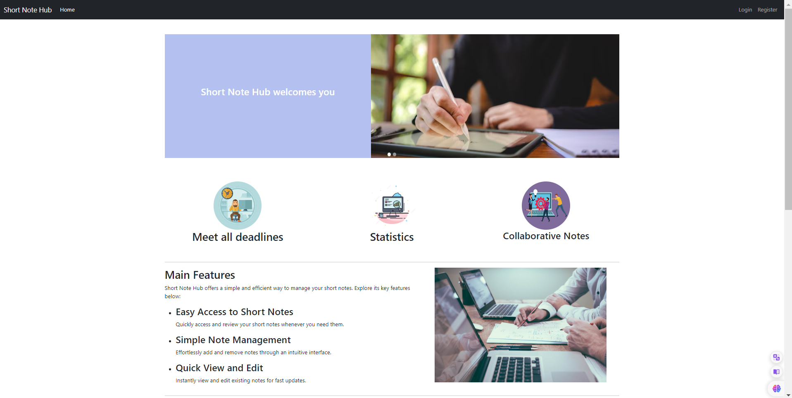
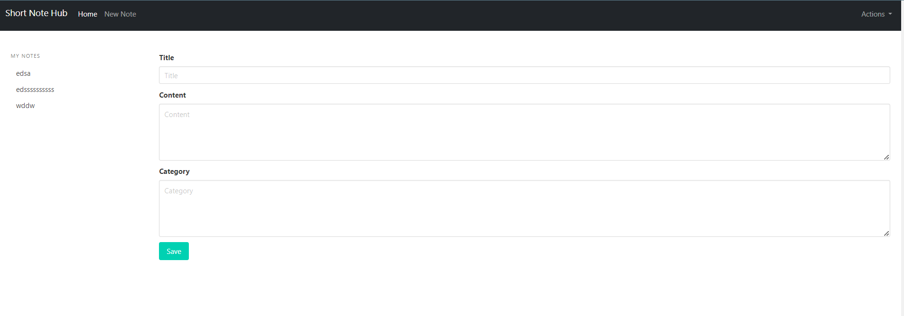
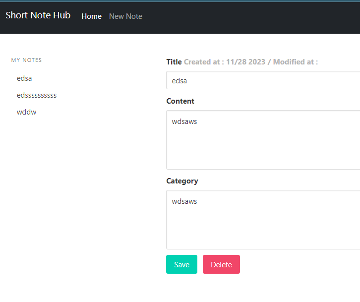
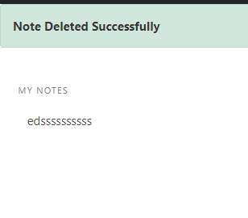

# Short Note Hub

The "Short Note Hub" is a web application designed for managing brief notes. Users can create, view (via a unique link), edit, and delete their own notes within the system. Each note is limited to a maximum length of 404 characters. This service provides a user-friendly platform for quick note-taking and organization, allowing individuals to efficiently capture and manage concise pieces of information tailored to their needs.

### 🚀 Main Features

1. **Create Notes:**
   - Users can create short notes, capturing important information or ideas quickly.

2. **View Notes via Link:**
   - Each note is accessible through a unique link, facilitating easy sharing with others.

3. **Edit Notes:**
   - Users have the ability to modify the content of their notes as needed.

4. **Delete Notes (User-Specific):**
   - Users can delete their own notes, providing control over their personal content.

5. **Note Length Limitation:**
   - The length of each note is restricted to a maximum of 404 characters, encouraging brevity.

# 📋Getting Started
To run the Short Note Hub locally, follow these steps:

+ **Clone the Repository:**:

        git clone https://github.com/your-username/short-note-hub.git
        cd short-note-hub
      
+ **Create a virtual environment to install dependencies in and activate it:**

        virtualenv2 --no-site-packages env
        source env/bin/activate
+ **Install Dependencies:**
        
        pip install -r requirements.txt

+ **Run Migrations:**
        
        python manage.py migrate

+ **Start the Server:**

        python manage.py runserver

+ **Access the Application:**
    
    Open your web browser and go to http://localhost:8000 to interact with the Short Note Hub.

## 🔨Usage Example

### Notes API

Example of using:

    http://127.0.0.1:8000

  

Example of using:

    http://127.0.0.1:8000/notes/

  

Example of using:

    http://127.0.0.1:8000/notes/?id=5

  

Example of using:

    http://127.0.0.1:8000/delete-notes/5/

  

This example assumes that your Django development server is running locally on http://127.0.0.1:8000/. 
Make sure to adjust the URLs accordingly if your setup is different.

